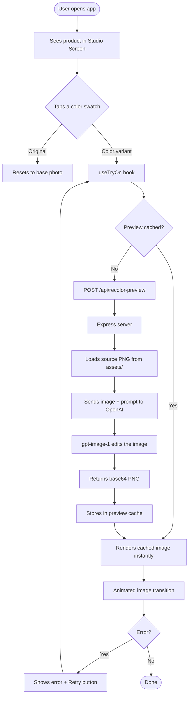
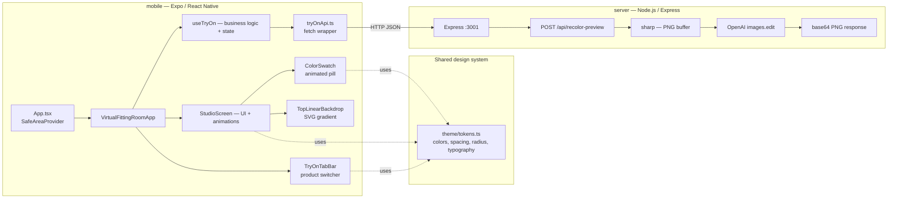
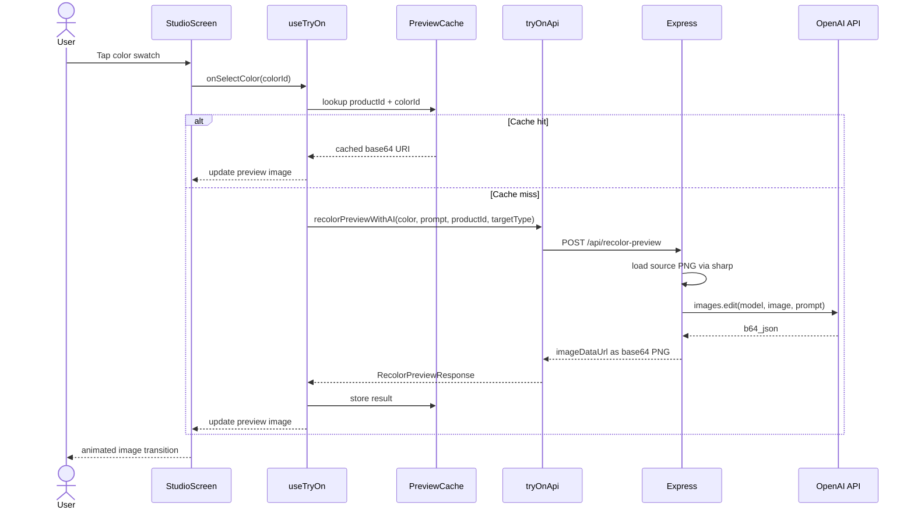

# Fitting Room — AI Virtual Try-On

A React Native + Node.js demo that lets users try on clothing and lipstick colors in real time using AI image editing (OpenAI `gpt-image-1`).

---

## Preview


---

## How It Works



---

## Architecture



---

## Data Flow



---

## Project Structure

```
fitting-app/
├── mobile/                         # Expo / React Native app
│   ├── src/
│   │   ├── components/
│   │   │   ├── ColorSwatch.tsx     # Animated color pill
│   │   │   ├── SurfaceCard.tsx     # Reusable frosted card
│   │   │   ├── TopLinearBackdrop.tsx  # SVG orange gradient backdrop
│   │   │   └── TryOnTabBar.tsx     # Glassmorphism product tab bar
│   │   ├── data/
│   │   │   └── mockCatalog.ts      # Product definitions & color palettes
│   │   ├── hooks/
│   │   │   └── useTryOn.ts         # State, caching, AI fetch logic
│   │   ├── screens/
│   │   │   └── StudioScreen.tsx    # Main try-on UI with Reanimated scroll
│   │   ├── services/
│   │   │   └── tryOnApi.ts         # Typed fetch wrapper for the server
│   │   ├── theme/
│   │   │   └── tokens.ts           # Color, spacing, radius, typography tokens
│   │   ├── types/
│   │   │   └── tryOn.ts            # Shared TypeScript interfaces
│   │   ├── utils/
│   │   │   └── color.ts            # hexToRgba helper
│   │   └── VirtualFittingRoomApp.tsx  # Root layout component
│   ├── App.tsx
│   ├── app.json
│   └── package.json
│
└── server/                         # Express + OpenAI backend
    ├── assets/
    │   ├── model-tshirt.png        # Source image for T-shirt try-on
    │   └── model-lipstick.png      # Source image for lipstick try-on
    ├── index.ts                    # Single-file Express server
    ├── package.json
    └── .env.example
```

---

## Tech Stack

| Layer | Technology |
|---|---|
| Mobile framework | Expo SDK 54 + React Native 0.81 |
| Language | TypeScript 5.9 (strict) |
| Animations | React Native Reanimated 4 |
| Visual effects | Expo Blur · react-native-svg |
| State pattern | Custom hook (`useTryOn`) with in-memory preview cache |
| Backend | Node.js 22 + Express 5 |
| AI image editing | OpenAI `gpt-image-1` via `images.edit()` |
| Image processing | sharp (PNG buffer preparation) |
| Server runtime | tsx (TypeScript execution, no build step) |

---

## Running Locally

### 1 — Server

```bash
cd server
cp .env.example .env        # add your OPENAI_API_KEY
npm install
npm start                   # listens on http://localhost:3001
```

Confirm it's healthy:

```bash
curl http://localhost:3001/health
# {"ok":true,"hasApiKey":true,"model":"gpt-image-1.5"}
```

### 2 — Mobile app

```bash
cd mobile
cp .env.example .env        # EXPO_PUBLIC_TRYON_API_URL=http://127.0.0.1:3001
npm install
npm run ios                 # or: npm run android
```

> **Android emulator:** the server URL defaults to `http://10.0.2.2:3001` automatically — no config needed.

---

## Key Design Decisions

**Race-condition prevention** — `useTryOn` assigns an incrementing `requestId` to every AI call. When a newer request fires before an older one resolves, the older response is silently discarded. Only the most recent result updates the UI.

**In-memory preview cache** — generated images are stored in a `useRef` map keyed by `"productId:colorId"`. Switching back to a color you already generated is instant — no second API call.

**Self-contained server** — the server package owns its own `assets/` folder, `package.json`, and `.env`. It has zero dependency on the mobile source tree and can be deployed independently.

**Theme tokens** — all colors, spacing, radii, and typography live in a single `tokens.ts` file. No magic strings in component stylesheets.

---

## API Reference

### `POST /api/recolor-preview`

Request body:

```json
{
  "productId": "essential-tee",
  "targetType": "tshirt",
  "colorHex": "#f3dd8c",
  "colorLabel": "Butter",
  "prompt": "Clean portrait with neutral pose and focus on shirt color."
}
```

Success response `200`:

```json
{
  "imageDataUrl": "data:image/png;base64,...",
  "colorHex": "#f3dd8c",
  "colorLabel": "Butter",
  "productId": "essential-tee",
  "targetType": "tshirt",
  "model": "gpt-image-1.5"
}
```

Error response `4xx / 5xx`:

```json
{ "error": "OPENAI_API_KEY is not configured on the server." }
```

### `GET /health`

```json
{ "ok": true, "hasApiKey": true, "model": "gpt-image-1.5" }
```
